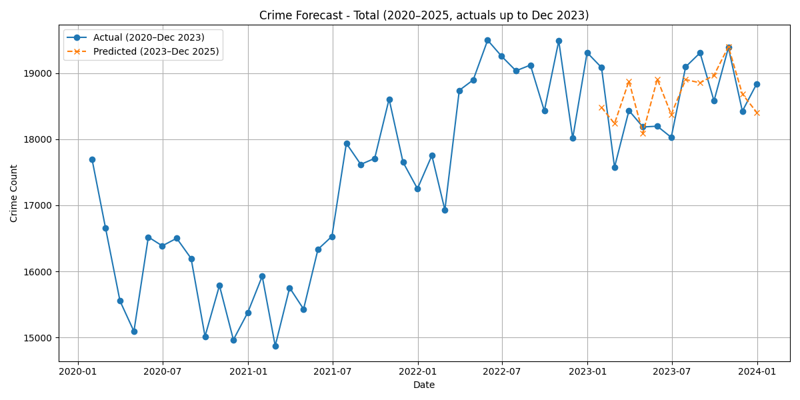
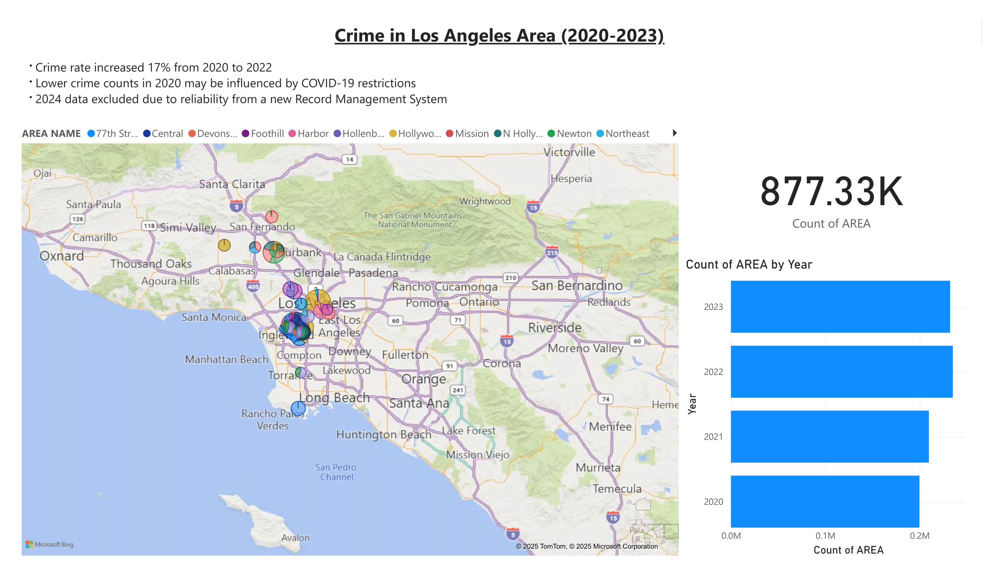
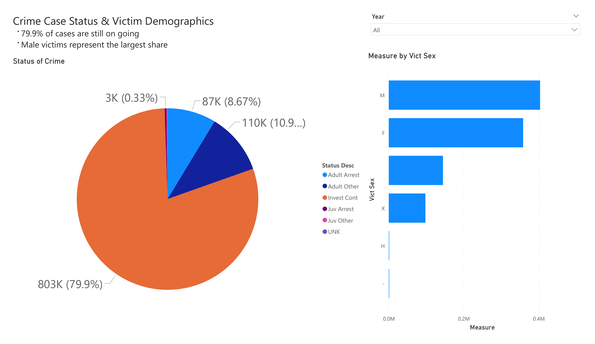
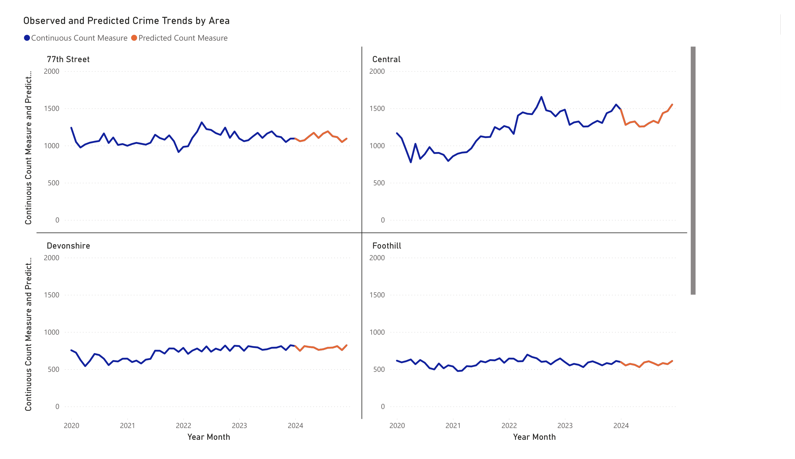

# Crime Forecasting Project

This project predicts crime trends using historical crime data (2020–2025).  
It combines **machine learning forecasting** with **Power BI dashboards** for visualization.

---

## Problem Statement

City officials and law enforcement agencies need data-driven insights to anticipate crime trends and allocate resources effectively.

---

## Approach

1. **Data Preparation**  
   - Cleaned and transformed crime records (2020–2025).  
   - Split datasets into training and test sets.

2. **Model Training**  
   - Machine learning model trained on data (2020–2022).  
   - Tested on 2023 for validation (Jan–Dec 2023).

3. **Visualization**  
   - Built interactive Power BI dashboards to show trends and forecasts.  
   - Forecast plot generated in Python showing actual vs predicted (Jan–Dec 2023).

---

## Tools & Technologies

- Python (Pandas, Scikit-learn, Matplotlib, XGBoost)  
- Power BI for visualization  
- Jupyter Notebook for experiments

---

## Results

- MAE (Jan–Dec 2023): **384.39**  
- RMSE (Jan–Dec 2023): **437.15**  

**Forecast Plot (actuals up to Dec 2023):**  
  

**Download Forecast CSV:** [forecast_2023.csv](./reports/forecast_2023.csv)  
**Download Forecast Plot:** [forecast_plot_v1_20250829.png](./reports/forecast_plot_v1_20250829.png)  

Evaluation metrics show that the model predicts monthly crime counts with an average error of ~384 cases per month and a root mean squared error of ~437 cases.

---

## Dashboard

- Exported Power BI report as PDF: [Crime Dashboard PDF](./reports/crime_forecast.pdf)  

- Screenshots of interactive dashboard:





---

## How to Run

1. Clone this repository:

```bash
git clone https://github.com/yourusername/crime-forecasting.git
cd crime-forecasting
```

2. Install dependencies:

```bash
pip install -r requirements.txt
```

3. Run the training pipeline or notebook:

```bash
python pipeline.py
# or
jupyter notebook notebooks/crime_forecast_2023.ipynb
```

---

## Next Steps

- Add GitHub Actions workflow for automation  
- Deploy FastAPI service to allow live predictions  
- Expand to real-time streaming data

---

## Project Structure

```
crime-forecasting/
│
├── data/                # Raw and processed datasets
│   └── processed/
│       └── cleaned_data.csv
├── notebooks/           # Jupyter notebooks (training & testing)
│   ├── crime_forecast_2023.ipynb
│   ├── data_cleaning.ipynb
│   ├── FastApi.ipynb
│   ├── pipeline.ipynb
│   └── xgb_crime_model.ipynb
├── reports/             # Power BI exports & screenshots
│   ├── crime_forecast.pdf
│   ├── crime_forecast.pbix
│   ├── forecast_2023.csv
│   ├── forecast_plot_v1_20250829.png
│   ├── crime_dashboard_page1.png
│   ├── crime_dashboard_page2.png
│   └── crime_dashboard_page3.png
├── scripts/             # Python scripts (pipeline, model, FastAPI)
│   ├── crime_forecast_2023.py
│   ├── data_cleaning.py
│   ├── FastApi.py
│   ├── xgb_crime_model.py
│   └── xgb_crime_model_v1_20250829.pkl
├── requirements.txt     # Dependencies
└── README.md            # Project documentation
```

---

## Author

Christodoulos Nicolaou  
Data Analyst | Aspiring Data Engineer

