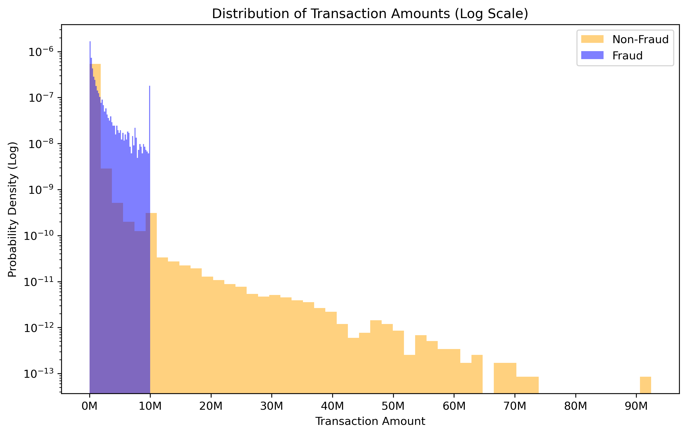
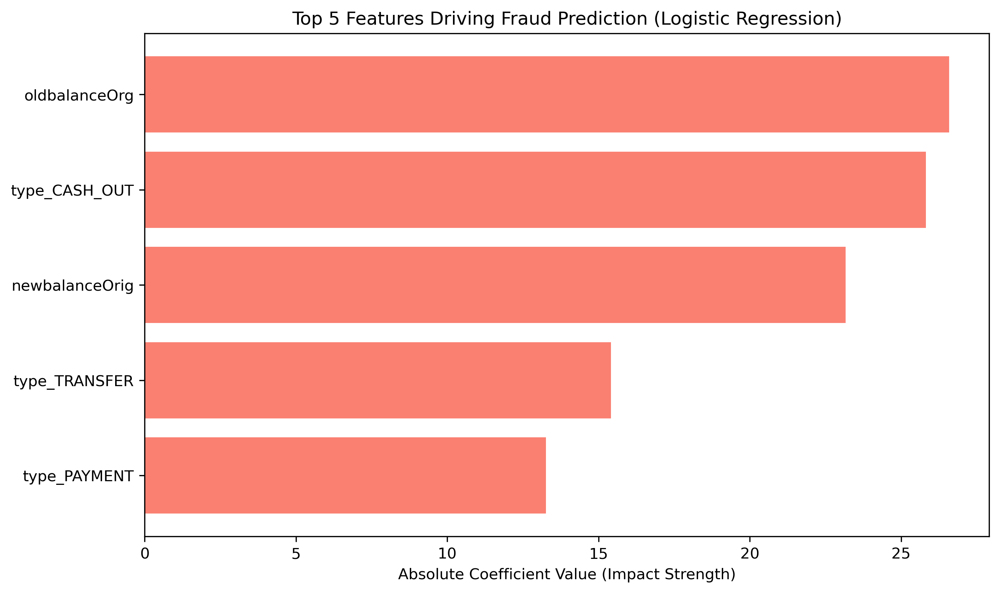
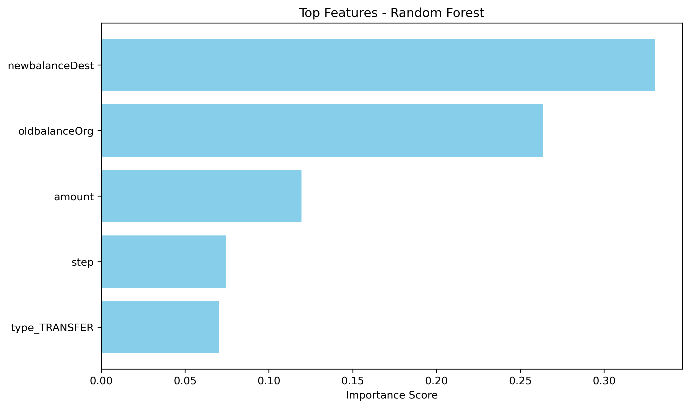

# Online Payment Fraud Detection Analysis

This project develops a high-performance classification system to detect fraudulent financial transactions. Using a dataset of 6.3 million records, the analysis evaluates the trade-offs between computational efficiency and predictive power.

\---
## Dataset
Due to the large file size (6.3M records), the raw data file `onlinefraud.csv` is not hosted in this repository. You can download the dataset from the following source:

* **Source:** [Kaggle - Online Payments Fraud Detection Dataset](https://www.kaggle.com/datasets/jainil30/online-payment-fraud-detection)
* **Instructions:** Download the CSV and place it in the `/data` folder before running the notebook.
---

## Problem Statement

Financial institutions require real-time fraud detection systems that can handle massive data volumes. The challenge lies in the extreme class imbalance (less than 0.1% of transactions are fraudulent) and the need to minimize False Positives to ensure a seamless customer experience.

\---

## Approach

1. Data Preparation \& Cleaning

   * Processed 6.3M rows of transaction data.
   * Handled categorical encoding and feature scaling for high-volume analysis.
   * Applied Stratified Splitting to maintain fraud proportions across training and testing sets.
2. Model Development

   * Baseline: Logistic Regression for rapid, linear classification.
   * Advanced: Random Forest Classifier to capture non-linear patterns and complex fraud behaviors.
   * Optimization: Adjusted decision thresholds (0.1) to prioritize the detection of fraudulent cases (Recall).
3. Performance Evaluation

   * Measured execution time to assess "real-world" deployment feasibility.
   * Evaluated models using Confusion Matrices, Precision-Recall curves, and Feature Importance scores.

\---

## Tools \& Technologies

* Python Pandas, NumPy, Scikit-learn
* Visualization Matplotlib, Seaborn
* Jupyter Notebook For end-to-end exploratory data analysis and modeling

\---

## Results

The following table summarizes the performance metrics and computational costs for our Baseline and Advanced fraud detection models.

| Metric | Baseline (Logistic Regression) | Advanced (Random Forest) |
| :--- | :--- | :--- |
| \*\*Execution Time\*\* | \~24 Seconds | \~5 Minutes 36 Seconds |
| \*\*Recall (Fraud)\*\* | 0.50 | \*\*0.73\*\* |
| \*\*False Positives\*\* | 495 | \*\*8\*\* |
| \*\*Precision (Fraud)\*\* | 0.63 | \*\*0.99\*\* |


Conclusion: The Random Forest model achieved a 23% increase in recall and reduced False Positives by 98% compared to the baseline. While it requires 13x more compute time, the significant reduction in customer friction (False Positives) makes it the superior choice for a production environment.

\---

## Visualization







\---

## How to Run

1. Clone this repository:

```bash
git clone https://github.com/Christo1011/data-analytics-portfolio.git
cd fraud-detection
```

2. Install dependencies:

```bash
pip install -r requirements.txt
```

3. Run the training pipeline or notebook:

```bash
jupyter notebook notebooks/"Online Payment Fraud Detection Analysis.ipynb"


\---

## Project Structure

fraud-detection/

│
├── data/                # Raw and processed datasets
│   └── onlinefraud.csv       # Dataset (6.3M records)

├── notebooks/           # Jupyter notebook

│   └── Online Payment Fraud Detection Analysis.ipynb

├── reports/             # Power BI exports \& screenshots
│   ├── transaction\_distribution.png
│   ├── logistic\_top\_features.png
│   └── classifier\_top\_features.png
├── reports           # Power BI exports \& screenshots
├── requirements.txt     # Dependencies
└── README.md            # Project documentation

\---

## Author

Christodoulos Nicolaou  
Data Analyst | Aspiring Data Engineer


&#x20;          # Project documentation

